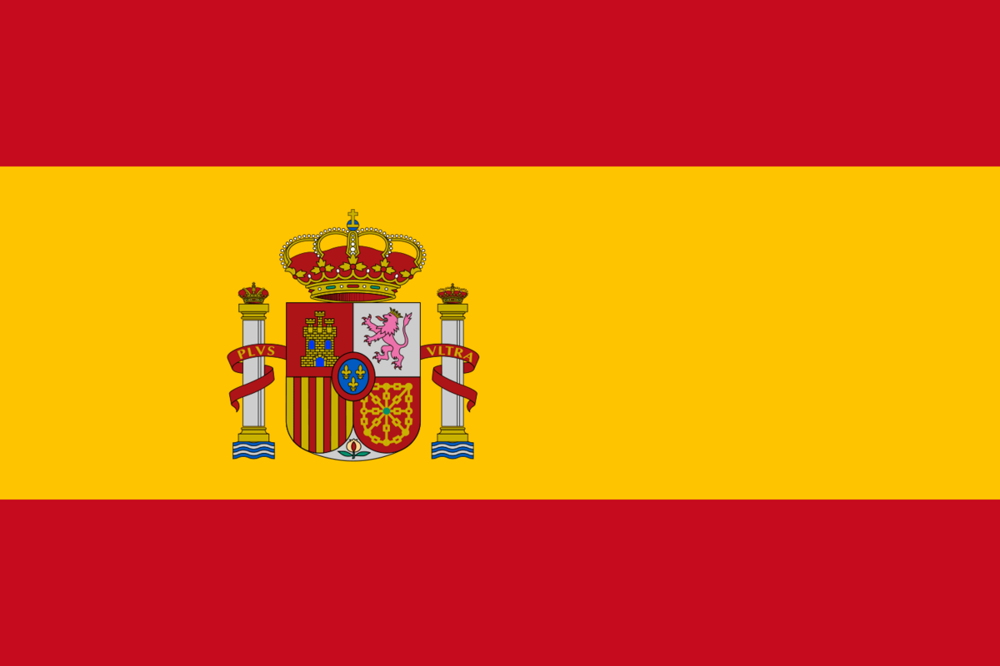

## About

I am a doctoral student at LMU Munich since October 2024.

Languages:      

## Research Interests

- Innovation in the semiconductor industries: clusters, agglomeration and spillovers.
- Trade and competition effect on firm innovation
- Climate change, trade and geopolitics

## Teaching

- **Mikroökonomie I - Übung** — Teaching Assistant, LMU Munich, Winter term 2025-26
- **Mikroökonomie I - Übung** — Teaching Assistant, LMU Munich, Summer term 2025
- **Mikroökonomie I - Übung** — Teaching Assistant, LMU Munich, Winter term 2024-25
- **Bachelor Thesis** — Supervisor, LMU Munich

## CV

**Master in Economics (M.Sc.)** — LMU Munich  
Oct 2021 – Dec 2023  
Thesis: *Climate Change, Trade and Geopolitics: The Arctic*

**Exchange Semester** — Université de Montréal  
Sep 2022 – Dec 2022  
PROSA Scholarship (LMUexchange)

**Bachelor in Economics (B.Sc.)** — LMU Munich  
Oct 2018 – Oct 2021  
Thesis: *Algorithmic Collusion: Coordination and Regulation*

**Translation and Interpreting (B.A.)** — Universidad de Málaga  
Oct 2014 – Jul 2018  
Focus: Simultaneous and conference interpreting

**Erasmus+ Exchange** — Ruprecht-Karls-Universität Heidelberg  
Oct 2016 – Aug 2017

[Download CV (PDF)](assets/cv.pdf)

## Contact

Email: [carlos.romero@econ.lmu.de](mailto:carlos.romero@econ.lmu.de)  
Office: Ludwigstraße 33, Room 356, 80799 München ([Map](https://www.lmu.de/raumfinder/index.html#/building/bw0110/map?room=011003356_))

Connect: [LinkedIn](https://www.linkedin.com/in/carlos-romero-bl%C3%A1zquez/)
